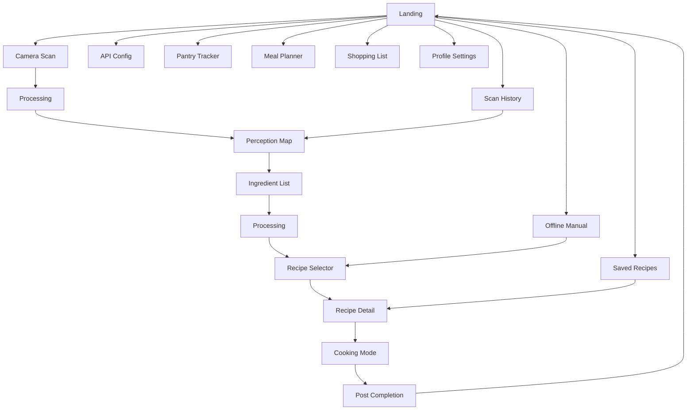
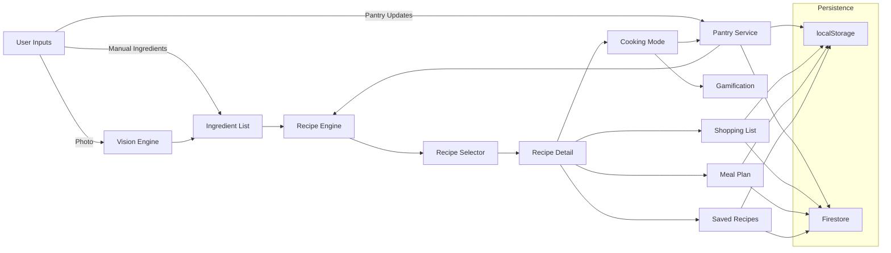
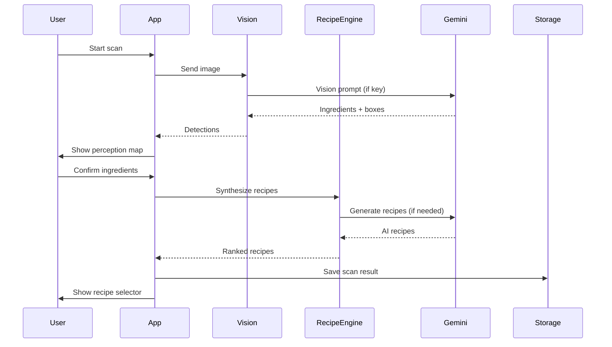

# Culinary Lens v2 - Complete Project Guide (Very Detailed)

This document explains every part of the project in detail: why the tech stack was chosen, how each page and component works, all features, problem statement and solution, novelty, competitive position, future upgrades, review questions, and a beginner-friendly explanation you can use with someone who has never seen the project.

## 1. Problem statement
People want to cook what they have, but the path from ingredients to a finished meal is fragmented. Users typically:
- Do not know what can be cooked with the ingredients they already own.
- Waste time searching multiple apps for recipes, substitutions, and shopping.
- Forget what is in the pantry or when it expires.
- Have dietary restrictions that are easy to miss when browsing recipes.
- Want a guided, step-by-step cooking mode without switching apps.
- Do not want to sign in just to try a product.

## 2. How this project solves the problem
Culinary Lens solves the entire cooking workflow end-to-end in one app. It turns ingredient images and pantry items into ranked recipes, checks diet and allergy safety, guides cooking with timers, updates pantry consumption, and generates shopping and meal plans. It also works without login or cloud, so users can start immediately.

Key solution pillars:
- Ingredient understanding: scan a photo or manually input items.
- Intelligent matching: rank recipes using static datasets plus AI generation.
- Safety and personalization: allergy filtering and taste model adjustments.
- Execution: cooking mode with step timers and voice playback.
- Planning: pantry management, meal planning, and shopping list.
- Resilience: offline mode, local data, and AI fallbacks.

## 3. Tech stack and why it was chosen

### 3.1 Frontend core
- React 19 + TypeScript
  - Why: React provides a component model that maps cleanly to the app's page and feature structure. TypeScript gives strict contracts for recipes, ingredients, and services, reducing runtime errors and enabling safe refactors.
  - Why not others: Angular introduces heavier structure and templating overhead for a single-page workflow. Vue is lighter but does not provide the same type integration depth for large domain models as TypeScript-first React.

- Vite
  - Why: extremely fast dev server and optimized builds for modern ESM. Works smoothly with React + TS and is easy to configure for static hosting.
  - Why not others: CRA is slower and deprecated. Webpack requires more configuration for similar results.

### 3.2 Styling
- Tailwind CSS and shadcn/ui
  - Why: Tailwind allows rapid UI iteration with predictable utility classes, and shadcn/ui provides accessible, composable UI primitives that fit custom design needs.
  - Why not others: Traditional CSS frameworks tend to impose rigid component styling. Custom SCSS would require more maintenance across a feature-heavy app.

### 3.3 AI and vision
- Google GenAI (Gemini)
  - Why: offers both text and vision capabilities, suitable for ingredient detection, recipe generation, and substitutions. Simple API, good quality output.
  - Why not others: Some vision APIs handle detection but not recipe synthesis, requiring multiple vendors. Gemini provides a unified model for the main AI tasks.

- Optional Hugging Face object detection
  - Why: provides an extra detection pass to improve bounding box accuracy when configured, without making it mandatory.
  - Why not others: dedicated detection systems require more setup and infrastructure. This is optional and only used if a token is configured.

### 3.4 Backend and persistence
- Firebase Auth + Firestore
  - Why: fast to set up, secure by default, scales well, and provides simple real-time sync for saved recipes, shopping, and meal plans.
  - Why not others: building a custom backend would slow development and add operational burden.

- localStorage (guest/offline)
  - Why: zero-friction persistence without login; enables offline-first design. Fits the app's local-first goal.

## 4. High-level architecture
The app is structured into four layers:

1) Presentation layer
- `src/App.tsx` is the workflow orchestrator.
- Page-level views are implemented inside `App.tsx` as conditional render blocks.
- Reusable feature UI lives in `src/components/*`.

2) Domain/service layer
- `src/services/*` contains business logic for scanning, recipes, substitutions, pantry, planning, shopping, gamification, storage, and taste modeling.

3) Persistence layer
- localStorage for guest/offline and fallback mode.
- Firebase Auth + Firestore for authenticated users.

4) External integrations
- Gemini for vision, recipe generation, substitutions, and image generation.
- Optional Hugging Face detector for extra vision accuracy.
- Google Shopping web search redirect for buying ingredients.

## 5. Boot process and app shell

### 5.1 Entry
- `src/main.tsx` renders the app into the DOM.
- `<ErrorBoundary />` wraps `<App />` to catch runtime errors and display a recovery UI.

### 5.2 Workflow orchestration
- `src/App.tsx` controls the entire app state.
- The app uses a finite workflow enum from `src/types.ts` to move between pages.
- `workflowHistory` is a stack that powers a global back button where appropriate.

Workflow states:
- LANDING
- API_CONFIG
- CAMERA_SCAN
- PROCESSING
- PERCEPTION_MAP
- INGREDIENT_LIST
- RECIPE_SELECTOR
- RECIPE_DETAIL
- COOKING_MODE
- POST_COMPLETION
- SAVED_RECIPES
- OFFLINE_MANUAL
- SCAN_HISTORY
- PANTRY_TRACKER
- MEAL_PLANNER
- PROFILE_SETTINGS
- SHOPPING_LIST

## 5.1 Diagrams (workflow, data flow, scan/synthesis sequence)

### 5.1.1 Workflow overview

### 5.1.2 Data flow (inputs to outcomes)

### 5.1.3 Scan and synthesis sequence

## 6. Detailed page-by-page breakdown (what every page does and how it is wired)

### 6.1 LANDING page
Purpose: main command center and hub for all features.

Core actions:
- Start camera scan.
- Start offline manual mode.
- Open saved recipes.
- Open scan history vault.
- Open API config.
- Show gamification card (streak, scans, cooks).
- Sign in/out (when available).

Key services and logic:
- `instantRecipeSuggestionService` builds quick-cook cards from pantry, recent scans, and current session ingredients.
- `gamificationService` provides streak and milestone info.
- `storageService` powers sign-in status and saved recipes count.

Navigation connections:
- LANDING -> CAMERA_SCAN, OFFLINE_MANUAL, SAVED_RECIPES, SCAN_HISTORY, API_CONFIG, RECIPE_SELECTOR.

### 6.2 API_CONFIG page
Purpose: enable or disable AI features by configuring Gemini API key.

Core actions:
- Input Gemini key.
- Test key using a minimal ping call.
- Toggle free-tier mode to reduce API usage.

Key services and logic:
- `App.tsx` manages the API key state and stores it in localStorage.
- Free-tier mode is stored as `FREE_TIER_MODE` and used by the recipe engine to skip AI generation when static matches are sufficient.

### 6.3 CAMERA_SCAN page
Purpose: capture image or upload for ingredient detection.

Core actions:
- Start camera (`getUserMedia` with environment-facing camera).
- Capture a frame to canvas.
- Upload an image file instead of camera.
- Trigger processing pipeline.

Key services and logic:
- `visionEngine` handles perception pipeline (HF optional + Gemini).
- The captured image is kept as the source for perception map rendering.

### 6.4 PROCESSING page
Purpose: show progress while AI or synthesis tasks run.

Core actions:
- Display stage text (e.g., scanning, synthesizing recipes).

Key services and logic:
- A simple UI state that keeps the user informed while asynchronous work completes.

### 6.5 PERCEPTION_MAP page
Purpose: visual trust step to show what the model detected.

Core actions:
- Display the image with markers or bounding boxes.
- List detected ingredients with confidence and category.
- Show counts for pantry sources (scan/manual).
- Continue to ingredient list.

Key services and logic:
- `visionEngine` output is converted into marker positions and displayed.
- Pantry stats are pulled from `pantryService` and current session data.

### 6.6 INGREDIENT_LIST page
Purpose: allow final correction and preference setup before recipe generation.

Core actions:
- Add or remove ingredients manually.
- See and apply substitutions.
- Merge pantry suggestions.
- Save/load ingredient presets.
- Set cuisine and nutrition goals.
- Start synthesis.

Key services and logic:
- `ingredientSuggestionService` provides type-ahead suggestions.
- `ingredientPresetService` persists presets.
- `substitutionService` suggests alternatives.
- `recipeEngine` uses the final ingredient list to synthesize recipes.

### 6.7 RECIPE_SELECTOR page
Purpose: display ranked recipes from static datasets and AI.

Core actions:
- Show recipe cards with readiness score.
- Save or remove recipes.
- Add recipes to the meal plan.
- Open recipe detail.

Key services and logic:
- `recipeEngine` provides the list and ranking scores.
- `storageService` and `localSavedRecipeService` handle saved recipes based on auth.
- `mealPlanService` inserts recipes into daily or weekly plan.

### 6.8 RECIPE_DETAIL page
Purpose: a decision page before cooking, with cost and nutrition context.

Core actions:
- Show hero image (AI or placeholder).
- Show nutrition chart and macros scaled by servings.
- Adjust serving size.
- Show smart cost estimate and timeline hints.
- Compare pantry and session ingredients to recipe requirements.
- Mark missing items and provide buy options.
- Open substitution sheet for missing items.
- Start cooking mode.

Key services and logic:
- `recipeImageService` generates or retrieves image.
- `substitutionService` provides ranked alternatives.
- `pantryService` is used to check what is in stock and to later update consumption.
- `instamartService` (Google Shopping redirect) opens buy URLs.

### 6.9 COOKING_MODE page
Purpose: step-by-step guided cooking.

Core actions:
- Display one instruction at a time.
- Auto-extract timer durations from explicit duration fields or parsed instruction text.
- Start/stop timers with `CookingTimer`.
- Optional auto-advance if timer is reliable.
- Voice playback and mute toggle.
- Step navigation and completion.

Key services and logic:
- `CookingTimer` handles countdown, pause, reset.
- `pantryService` updates consumption after cooking.
- `gamificationService` increments streak and achievements.

### 6.10 POST_COMPLETION page
Purpose: celebrate and summarize the cook.

Core actions:
- Show completion message.
- Show macro summary.
- Display newly unlocked badges.
- Return to home or scan flow.

Key services and logic:
- `gamificationService` provides badge data.

### 6.11 SAVED_RECIPES page
Purpose: personal cookbook.

Core actions:
- List saved recipes (cloud if signed in, local if guest).
- Remove saved recipe.
- Start cooking.

Key services and logic:
- `storageService` for Firestore-backed saved recipes.
- `localSavedRecipeService` for guest mode.

### 6.12 OFFLINE_MANUAL page
Purpose: no-camera/no-AI fallback discovery.

Core actions:
- Add manual ingredients.
- Set cuisine filters.
- Match against static datasets.
- Show local-only results when AI is disabled or no API key.

Key services and logic:
- `recipeEngine` matches against `STATIC_RECIPES` and `LARGE_RECIPE_DATABASE` without AI.

### 6.13 SCAN_HISTORY page
Purpose: scan vault and reusability.

Core actions:
- List scans with timestamp and confidence.
- Show change vs previous scan.
- Reuse a scan as current session ingredients.
- Delete scans.

Key services and logic:
- `scanResultService` handles storage and retrieval.

### 6.14 PANTRY_TRACKER page
Purpose: full pantry management.

Core actions:
- Add items with expiry date.
- Auto-fill category, storage, and shelf life.
- Search and suggestion for ingredients.
- Expiry alerts.
- Source analytics for scan vs manual.

Key services and logic:
- `pantryService` stores and calculates expiry.
- `pantryProductDataset` supplies metadata.
- `ingredientSuggestionService` powers type-ahead.

### 6.15 MEAL_PLANNER page
Purpose: day-by-day and weekly planning.

Core actions:
- View daily plan and weekly grid.
- Add/edit/delete entries.
- Auto-generate a week based on nutrition goals.

Key services and logic:
- `mealPlanService` handles CRUD and optional live updates.
- Weekly generation ensures unique IDs before writing.

### 6.16 PROFILE_SETTINGS page
Purpose: personalization and account controls.

Core actions:
- Skill level selection.
- Allergy add/remove with suggestions.
- Taste model edits (spice tolerance, diet type, cuisine preferences).
- Notification toggle.
- Sign out.

Key services and logic:
- `allergyService` stores allergies.
- `tasteModelService` stores taste profile.
- localStorage stores notification preference.

### 6.17 SHOPPING_LIST page
Purpose: grocery planning and purchasing.

Core actions:
- Add items with quantity and unit.
- Suggest ingredients while typing.
- Toggle purchased state.
- Remove items and clear checked items.
- Show completion progress.
- Open Google Shopping search for buying.

Key services and logic:
- `shoppingListService` (local or Firestore) handles persistence.
- `ingredientSuggestionService` provides suggestions.
- `instamartService` opens web search.

## 7. All components and how they are used on pages

### 7.1 `src/components/CookingTimer.tsx`
Used on:
- COOKING_MODE page

Responsibilities:
- Circular progress timer UI.
- Play/pause/reset controls.
- Auto-start support for step timers.

### 7.2 `src/components/PantryTracker.tsx`
Used on:
- PANTRY_TRACKER page

Responsibilities:
- Pantry CRUD UI.
- Expiry warnings and metadata display.
- Source analytics and last-cooked context.

### 7.3 `src/components/MealPlanner.tsx`
Used on:
- MEAL_PLANNER page

Responsibilities:
- Weekly grid and day view UI.
- Meal plan entry creation and editing.
- Weekly auto-generation UI.

### 7.4 `src/components/ProfileSettings.tsx`
Used on:
- PROFILE_SETTINGS page

Responsibilities:
- User profile controls (skill level, allergies, taste model, notifications).
- Account sign-out and settings view.

### 7.5 `src/components/ShoppingList.tsx`
Used on:
- SHOPPING_LIST page

Responsibilities:
- Shopping list CRUD UI.
- Progress tracking and buy actions.

### 7.6 `src/components/ErrorBoundary.tsx`
Used on:
- Global wrapper in `src/main.tsx`

Responsibilities:
- Catch runtime exceptions.
- Show a fallback UI with a reload option.

## 8. All features (complete list)

### 8.1 Ingredient capture and perception
- Camera capture using device camera.
- Image upload.
- AI ingredient detection with bounding boxes.
- Confidence visualization and deduplication.
- Perception map overlay for trust.

### 8.2 Ingredient management
- Manual ingredient add/remove.
- Pantry suggestions and merging.
- Ingredient presets save/load/delete.
- Ingredient substitutions with ranking.

### 8.3 Recipe discovery and generation
- Static dataset matching.
- Large synthetic recipe dataset matching.
- AI recipe generation when needed.
- Recipe readiness scoring.
- Allergy filtering and diet-safe results.
- Free-tier mode to reduce AI calls.

### 8.4 Recipe exploration
- Recipe cards with key stats.
- Recipe detail view with macro chart.
- Serving size scaling and recalculated macros.
- Smart cost estimate in INR.
- Timeline hints and step durations.

### 8.5 Cooking assistance
- Step-by-step cooking mode.
- Timer extraction from steps.
- `CookingTimer` with play/pause/reset.
- Voice playback and mute.
- Auto-advance only when timer is reliable.

### 8.6 Pantry management
- Pantry CRUD.
- Expiry tracking and alerts.
- Category/storage metadata.
- Source analytics (scan vs manual).
- Post-cook consumption tracking.

### 8.7 Meal planning
- Daily and weekly planning views.
- Add/edit/delete plan entries.
- Weekly plan generation by goal.

### 8.8 Shopping list
- Shopping list CRUD.
- Ingredient suggestions while typing.
- Completion progress.
- Google Shopping redirect for purchase.

### 8.9 Saved recipes
- Save/unsave recipes.
- Cloud sync when signed in.
- Local fallback for guest users.

### 8.10 Scan history
- Scan vault with timestamps.
- Delta comparison between scans.
- Reuse scan as new session.
- Delete scan results.

### 8.11 Profile and personalization
- Skill level selection.
- Allergy list and filtering.
- Taste profile (diet, spicy, cuisines).
- Notifications toggle.

### 8.12 Gamification
- Streak tracking.
- Scan count and cook count.
- Badge unlocks.

### 8.13 Offline-first resilience
- Works without login.
- Works without API key.
- Static datasets and local storage fallback.
- Graceful degradation when AI fails.

## 9. Service-by-service technical detail

### 9.1 Vision and perception
`src/services/visionEngine.ts`
- Pipeline: optional Hugging Face detection + Gemini enrichment.
- Produces structured JSON with ingredient names, confidence, and bounding boxes.
- Filters non-food labels.
- Deduplicates and merges detections.
- Caches last result by image signature.

### 9.2 Recipe intelligence
`src/services/recipeEngine.ts`
- Uses combined static dataset as baseline (`STATIC_RECIPES` + `LARGE_RECIPE_DATABASE`).
- Ranks by ingredient overlap, cuisine preference, and nutrition goal.
- Applies allergy filtering.
- Free-tier mode: skip AI if enough static matches.
- AI generation: Gemini produces additional recipes when needed.
- Failure fallback: if AI fails, return static matches only.

`src/services/instantRecipeSuggestionService.ts`
- Fast suggestions for landing page.
- Uses pantry + recent scans + current session.
- Applies taste model multipliers and allergy penalties.

### 9.3 Recipe images
`src/services/recipeImageService.ts`
- Attempts Gemini image generation.
- Caches per recipe name.
- Falls back to SVG placeholder if unavailable.

### 9.4 Pantry and shelf life
`src/services/pantryService.ts`
- CRUD for pantry entries.
- Auto metadata (category/storage/expiry) using dataset.
- Expiry warnings and consumption updates.

`src/services/pantryProductDataset.ts`
- Ingredient metadata map: category, storage, shelf life.

### 9.5 Shopping
`src/services/shoppingListService.ts`
- Guest mode local list.
- Signed-in mode Firestore list.
- Add/update/remove/clear operations.

`src/services/instamartService.ts`
- Opens Google Shopping search URL with combined query.
- Avoids popup blockers by opening a single tab.

### 9.6 Planner and saved recipes
`src/services/mealPlanService.ts`
- Local or Firestore meal plan storage.
- CRUD and optional listener.

`src/services/storageService.ts`
- Firebase auth and saved recipe storage.
- Real-time listeners for cloud updates.
- Error diagnostics for Firestore.

`src/services/localSavedRecipeService.ts`
- Guest fallback for saved recipes.

### 9.7 User intelligence and safety
`src/services/allergyService.ts`
- Store allergy list.
- Filter recipes by allergen match.

`src/services/tasteModelService.ts`
- Store taste preferences (diet, spice, cuisines).

`src/services/substitutionService.ts`
- AI substitutions when key exists.
- Static substitutions when AI is unavailable.
- Pantry-aware ranking prioritizes in-stock items.

`src/services/gamificationService.ts`
- Tracks streaks and counters.
- Unlocks badges.

`src/services/scanResultService.ts`
- Store scan results with max history cap.
- Provides confidence summary.

`src/services/ingredientSuggestionService.ts`
- Builds suggestion dictionary from datasets.

`src/services/ingredientPresetService.ts`
- Save and load reusable ingredient bundles.

## 10. Data model summary

Main types from `src/types.ts`:
- `Ingredient`: name, quantity, unit, source, confidence.
- `Recipe`: title, cuisine, steps, nutrition, estimated time, cost.
- `RecipeStep`: instruction, duration, tools.
- `NutritionalGoal`: enum for balanced/high protein/low carb/veg forward.
- `UserProfile`: skill level, allergies, taste model.
- `ShoppingListItem`: name, quantity, unit, checked state.
- `ScanResult`: timestamp, detected ingredients, confidence summary.
- `Substitution`: original item, alternatives, reasons.
- `WorkflowState`: current page state.

Flow connections:
- Ingredients feed the recipe engine.
- Recipes drive selector -> detail -> cooking.
- Shopping items and meal plan entries are created from recipes.
- Scan results enrich quick suggestions and history.

## 11. Datasets and offline assets

### 11.1 Static recipes (`src/services/staticRecipes.ts`)
- Curated list used for deterministic fallback.

### 11.2 Generated recipe database (`src/services/recipeDatabase.ts`)
- `generateRecipes(2000)` creates a large offline dataset.
- Provides breadth for offline/manual matches.

### 11.3 Pantry dataset (`src/services/pantryProductDataset.ts`)
- Metadata for storage and shelf life.

### 11.4 Ingredient suggestion dictionary
- Built from static + generated recipe datasets plus defaults.

## 12. Offline-first behavior (exact)
The app is usable without login or API key. It falls back to static datasets and local storage while keeping the core cooking flow intact.

Local storage keys used:
- `GEMINI_API_KEY`
- `FREE_TIER_MODE`
- `SCAN_VAULT_RESULTS`
- `CULINARY_LENS_PANTRY`
- `CULINARY_LENS_LAST_COOK_ACTIVITY`
- `CULINARY_LENS_LOCAL_SAVED_RECIPES`
- `CULINARY_LENS_LOCAL_SHOPPING_LIST`
- `CULINARY_LENS_LOCAL_MEAL_PLAN`
- `CULINARY_LENS_INGREDIENT_PRESETS`
- `CULINARY_LENS_TASTE_MODEL`
- `CULINARY_LENS_ALLERGIES`
- `CULINARY_LENS_GAMIFICATION`
- `CULINARY_LENS_LAST_SCAN_DAY`
- `CL_NOTIFICATIONS_ENABLED`

## 13. API configuration and keys

### 13.1 Gemini API key
Used by:
- `visionEngine` (ingredient detection)
- `recipeEngine` (AI recipe generation)
- `substitutionService` (AI substitutions)
- `recipeImageService` (AI images)

Stored as:
- `GEMINI_API_KEY` in localStorage.

Validation:
- API Config page calls a minimal prompt to verify the key.

### 13.2 Hugging Face token (optional)
Used by:
- `visionEngine` for stage-1 detection.

Behavior:
- If missing, skip HF stage and use Gemini-only perception.

### 13.3 Firebase config
Defined in:
- `src/firebase.ts` (uses `src/firebase-applet-config.json`).

Responsibilities:
- Google sign-in and auth listener.
- Firestore for user data (saved recipes, meal plan, shopping list).

## 14. Google Shopping integration
The app opens a Google Shopping search URL for purchase actions.

Why this approach:
- No API keys or external integrations required.
- Works immediately in browser.
- Avoids dependency on any specific commerce provider.

Entry points:
- Buy actions in Shopping List.
- Buy actions for missing ingredients in Recipe Detail.

## 15. Why this project is novel
- End-to-end flow: from a photo to a cooked meal, without leaving the app.
- Local-first with AI augmentation: core flow works offline, and AI is optional.
- Trust-building perception map that visualizes detection results.
- Hybrid recipe engine: deterministic static match + AI expansion.
- Full planning ecosystem: pantry, meal plans, shopping list, saved recipes.
- Cooking mode integrated with pantry consumption and gamification.

## 16. Why someone should choose this project
- It removes friction: no sign-up required to use core features.
- It saves time: one app for scan, recipe, cook, and shop.
- It respects dietary restrictions and allergies.
- It is resilient: works without network or AI key.
- It is scalable: service-based architecture is easy to extend.

## 17. Why it can be considered one of the best in the industry
This is a strong claim, so it is based on objective strengths:
- Coverage: few apps integrate scanning, planning, cooking, pantry, and shopping in one flow.
- Reliability: offline-first architecture means the app is usable even without API access.
- Trust: perception map makes AI output visible and inspectable.
- Efficiency: free-tier mode and local dataset reduce API cost.
- Personalization: taste model and allergy filtering improve user safety and satisfaction.

## 18. Future upgrades (roadmap suggestions)
- Multilingual UI and speech instructions.
- OCR for reading labels and expiry dates from packaging.
- Barcode scanning for pantry entries.
- Nutrition database integration for exact macro values.
- Recipe rating and user feedback loop to refine ranking.
- Smart meal plan optimization for budget and calorie targets.
- Shared household pantry sync with multi-user roles.
- Exportable shopping list for Instacart, BigBasket, or Amazon Fresh.
- Offline on-device vision model for real-time detection.
- A/B testing system for cooking mode UX improvements.

## 19. How to explain the project to someone who does not know it

Simple explanation:
"Culinary Lens is a cooking assistant. You point your camera at your ingredients, it recognizes what you have, and then it suggests recipes. You can choose a recipe, and the app guides you step by step while timing the cooking. It also keeps a pantry list, builds a shopping list for missing items, and plans meals for the week. It works even if you do not sign in and even if you do not have an AI key."

Slightly more detailed explanation:
"Think of it as a cooking workflow in one app: scan ingredients -> confirm them -> get recipes -> cook with a guided timer. It remembers your pantry, saves your recipes, respects allergies, and helps you plan meals and shop. The AI part adds smart detection and extra recipes, but the app still works with a built-in dataset if AI is unavailable."

## 20. Review questions (comprehensive list)
Use these questions for project reviews, interviews, or presentations.

### 20.1 Architecture and workflow
- Why is a workflow state machine used instead of a router?
- How does `workflowHistory` enable back navigation?
- What are the tradeoffs of single-page conditional rendering?

### 20.2 Tech stack
- Why React + TypeScript instead of Vue or Angular?
- Why Vite instead of Webpack or CRA?
- Why Firebase instead of a custom backend?
- Why localStorage instead of IndexedDB for offline data?

### 20.3 AI and vision
- How does the vision pipeline combine HF and Gemini outputs?
- How is ingredient confidence calculated and merged?
- How does the app behave when the AI key is missing?
- How is AI cost minimized (free-tier mode)?

### 20.4 Recipe engine
- How does static matching work?
- What ranking factors are used?
- How do allergy filters affect recipe results?
- How are AI-generated recipes combined with static ones?

### 20.5 Cooking mode
- How are timers extracted from steps?
- Why is auto-advance limited to trusted timers?
- How does the app update pantry consumption after cooking?

### 20.6 Pantry and planning
- How are expiry dates calculated?
- How are pantry items categorized and stored?
- How does weekly meal plan generation avoid ID collisions?

### 20.7 Shopping and saved recipes
- How does the shopping list persist in guest vs signed-in mode?
- How does the app handle Firestore errors for saved recipes?
- Why use Google Shopping web search instead of a shopping API?

### 20.8 Security and data
- What data is stored locally vs in Firestore?
- What do the Firestore rules enforce?

### 20.9 UX and resilience
- How does the app handle network or API failures?
- How does the offline manual flow still provide results?

### 20.10 Testing and quality (if asked)
- What core flows would you test end-to-end?
- What unit tests are most critical in services?

## 21. Everything else you should know (full summary checklist)
- This is a local-first cooking assistant with optional AI.
- It supports both guest and signed-in workflows.
- It combines scanned, pantry, and manual ingredients.
- It uses static datasets as a fallback when AI is unavailable.
- It includes full planning and shopping tools, not just recipes.
- It is safe for dietary restrictions with allergy filtering.
- It has a guided cooking mode with timers and voice support.
- It is designed to be resilient and cost-aware.
